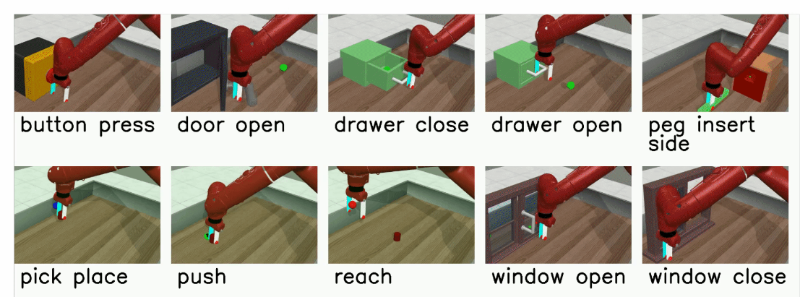
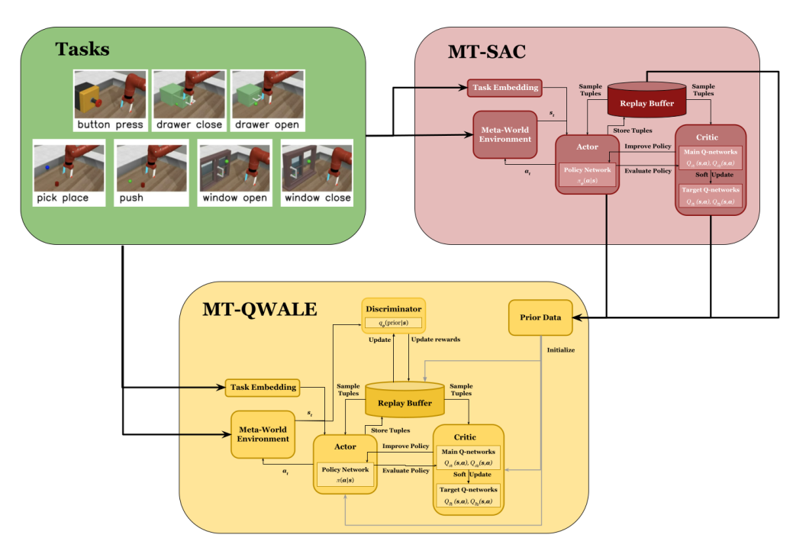

# Abstract 
 <div align="justify"> 
At present, robots typically require extensive training to successfully accomplish a
single task. However, to truly enhance their usefulness in real-world scenarios, robots
should possess the capability to perform multiple tasks effectively. To address this
need, various multi-task reinforcement learning (RL) algorithms have been developed, including multi-task proximal policy optimization (PPO), multi-task trust region
policy optimization (TRPO), and multi-task soft-actor critic (SAC). Nevertheless,
these algorithms demonstrate optimal performance only when operating within an
environment or observation space that exhibits a similar distribution. In reality, such
conditions are often not the norm, as robots may encounter scenarios or observations
that differ from those on which they were trained.

For instance, if a robot is trained to pick and place a sphere from a specific set of
locations, it should also possess the capability, during testing, to successfully pick and
place a cube from different positions, at least those that are in close proximity to the
trained positions. Addressing this challenge, algorithms like Q-Weighted Adversarial
Learning (QWALE) attempt to tackle the issue by training the base algorithm (gen-
erating prior data) solely for a particular task, rendering it unsuitable for generalization
across tasks.

And so, the aim of this research project is to enable a robotic arm to successfully
execute seven distinct tasks within the Meta World environment. These tasks encompass
Pick and Place, Window Open and Close, Drawer Open and Close, Push, and Button
Press. To achieve this, a multi-task soft actor critic (MT-SAC) is employed to train
the robotic arm. Subsequently, the trained model will serve as a source of prior data
for the single-life RL algorithm. The effectiveness of this MT-QWALE algorithm will
be assessed by conducting tests on various target positions (novel positions), i.e., for
example, different window positions in the Window Open and Close task.



At the end, a comparison is provided between the trained MT-SAC and the MT-
QWALE algorithm where the MT-QWALE performs better. An ablation study demon-
strates that MT-QWALE successfully completes tasks with slightly more number of
steps even after hiding the final goal position.
</div>




# Installation

Please reach out to us to download the Trained MT-SAC Model. To run the SLRL code and visulize the robotic arm, add the unzipped models to the SLRL tmp folder as well. 

### Conda Environment
 
```  
conda env create --name env_name --file config.yml
```
Activate the environment and after that run the following command to download dependencies
```
pip install -r requirements.txt
```
(Note: You need to install mujoco simulator and add it to the system PATH. Please manually install metaworld if the version in the requirement files does not work.


# Evaluation
The list of environment names corresponding are available in train.py in single-life-rl_MT folder
```
LD_PRELOAD=/usr/lib/x86_64-linux-gnu/libGLEW.so python3 train.py use_discrim=True rl_pretraining=True q_weights=True online_steps=100000 env_name=sawyer_window_open
```

# Acknowledgements

To train the Single Life RL Model, we use the original SLRL code and modify it for Multitask setting.

```
@article{chen2022you,
  title={You only live once: Single-life reinforcement learning},
  author={Chen, Annie and Sharma, Archit and Levine, Sergey and Finn, Chelsea},
  journal={Advances in Neural Information Processing Systems},
  volume={35},
  pages={14784--14797},
  year={2022}
}
```


